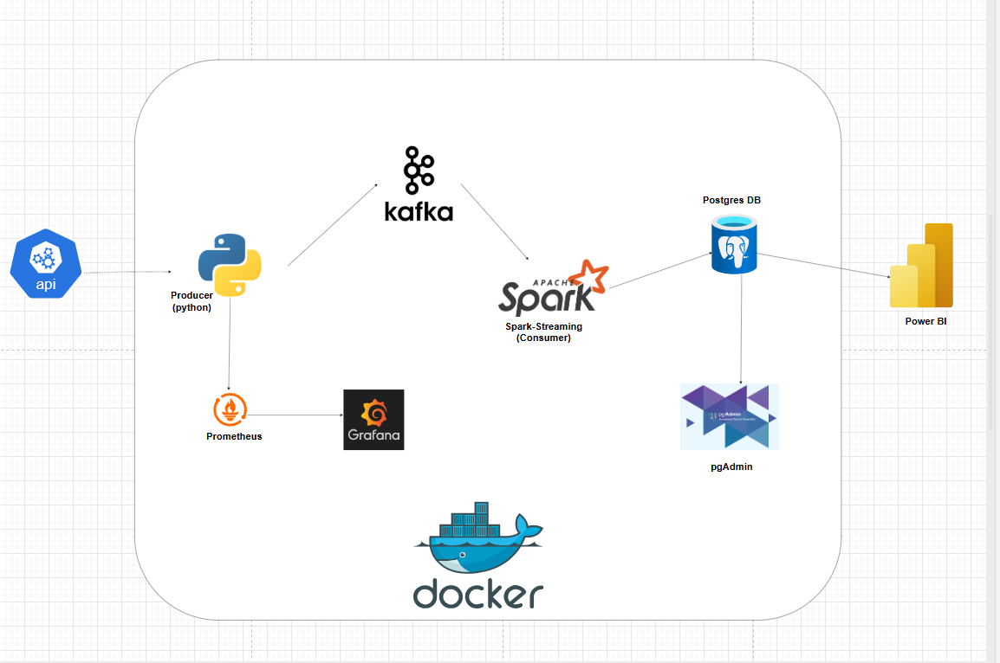
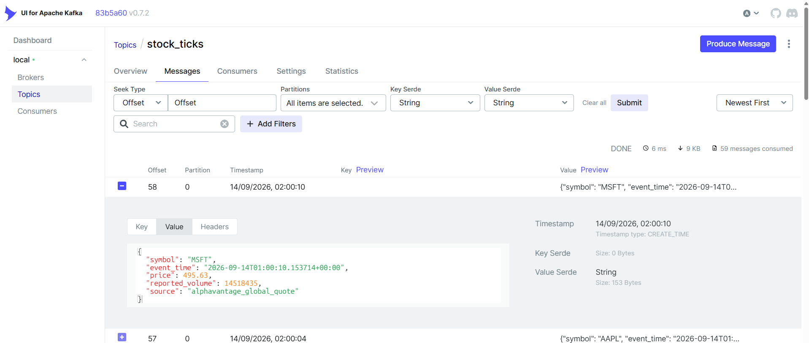
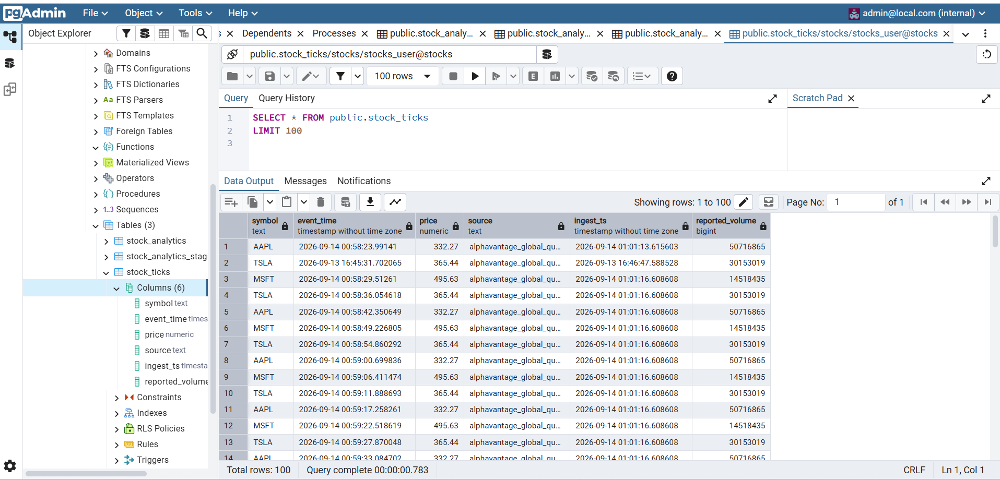
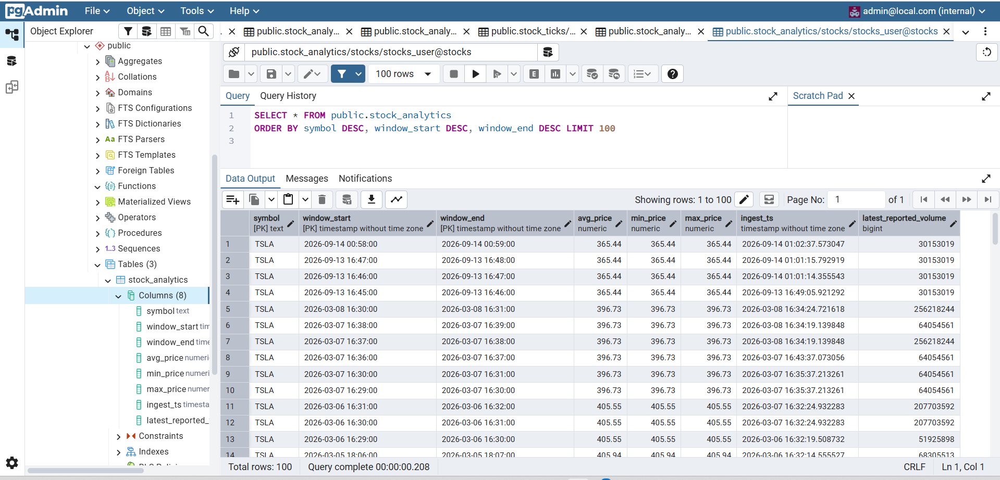
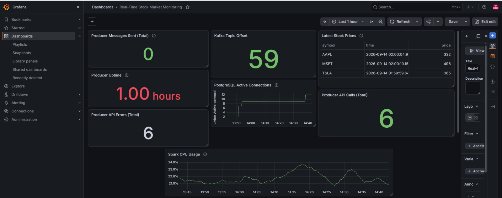

# Near-Real-Time Stock Market Data Engineering Pipeline

An end-to-end, containerized data engineering platform that polls stock quotes from Alpha Vantage, publishes normalized observations to Apache Kafka, processes the stream with Apache Spark Structured Streaming, persists raw and one-minute analytical data in PostgreSQL, and exposes operational metrics through Prometheus and Grafana.

> **Technical wording:** the source ingestion is **near-real-time polling**, while the downstream architecture is a **streaming pipeline**. It is not an exchange-grade real-time market-data feed.

## Architecture at a glance



### Data flow

```text
Alpha Vantage GLOBAL_QUOTE
          |
          | periodic HTTP polling
          v
Python Producer
  | validation / normalization
  | JSON serialization
  | Prometheus metrics
          |
          v
Kafka: stock_ticks
          |
          v
Spark Structured Streaming
      /                 \\
     /                   \\
    v                     v
PostgreSQL           One-minute
stock_ticks          event-time analytics
                         |
                         v
                    PostgreSQL
                 stock_analytics

Observability:
Producer -> Prometheus -> Grafana

Orchestration:
All services -> Docker Compose
```

## Why this project matters

This project demonstrates how to build a small but complete streaming data platform without coupling the external API directly to the database. Kafka provides the transport boundary, Spark handles streaming transformations, PostgreSQL provides durable queryable storage, and Prometheus/Grafana provide a separate operational monitoring path.

The architecture is intentionally portfolio-scale and locally runnable, while covering transferable engineering practices such as schema enforcement, validation, event-time windowing, checkpointing, database UPSERTs, service health checks, and container orchestration.

## Technology stack

| Layer | Technology |
|---|---|
| Market data | Alpha Vantage `GLOBAL_QUOTE` |
| Ingestion | Python, `requests` |
| Messaging | Apache Kafka + ZooKeeper |
| Stream processing | Apache Spark Structured Streaming / PySpark |
| Storage | PostgreSQL 16 |
| Kafka administration | Kafka UI |
| Database administration | pgAdmin |
| Metrics | Prometheus + `prometheus_client` |
| Dashboards | Grafana |
| Containers | Docker / Docker Compose |
| Runtime | Spark 3.5.1, Confluent Platform 7.5.0 |

## 1. Source ingestion — Alpha Vantage

The Python producer polls Alpha Vantage's `GLOBAL_QUOTE` endpoint for the configured ticker symbols. The default configuration uses a one-hour polling interval:

```text
POLL_INTERVAL_SECONDS=3600
```

This conservative interval is deliberate for the portfolio deployment and is subject to the API plan's quota and entitlement.

## 2. Python producer

The producer is responsible for:

- reading configuration from environment variables;
- starting the Prometheus metrics endpoint;
- establishing and retrying the Kafka connection when the broker is unavailable;
- polling the external API;
- validating required quote fields;
- normalizing observations into a consistent JSON event contract;
- publishing messages to `stock_ticks`;
- updating operational metrics.

The producer exposes its metrics internally to Prometheus on port `8000`.

### Kafka event contract

```json
{
  "symbol": "TSLA",
  "event_time": "2026-09-13T16:45:31.702065+00:00",
  "price": 365.44,
  "reported_volume": 30153019,
  "source": "alphavantage_global_quote"
}
```

`event_time` is generated by the producer when the quote is observed. It should therefore be interpreted as an **observation/ingestion timestamp**, not as an exchange-provided trade timestamp.

### Volume semantics

The quote endpoint returns a reported volume snapshot. Repeated polling snapshots are not independent trade-volume increments, so the pipeline does **not** sum repeated snapshots as though they were individual trades. The analytical layer keeps the latest reported volume for each one-minute window.

## 3. Kafka — transport and decoupling

Kafka is the boundary between ingestion and downstream processing.

Application topic:

```text
stock_ticks
```

Inside Docker Compose, the producer and Spark connect using:

```text
kafka:9092
```

### Kafka evidence

The screenshot below shows genuine Alpha Vantage events flowing through `stock_ticks`. The expanded message demonstrates the normalized payload and its fields.



Kafka UI is available locally at:

```text
http://localhost:8080
```

## 4. Spark Structured Streaming — processing and analytics

Spark consumes new records from Kafka using an explicit JSON schema and:

1. parses the incoming event;
2. converts the observation timestamp into Spark timestamp form;
3. persists raw observations to PostgreSQL;
4. calculates one-minute, symbol-level event-time analytics;
5. uses a one-minute watermark to limit streaming state;
6. maintains separate checkpoints for the raw and analytical streaming queries.

The stream is configured with:

```text
startingOffsets=latest
```

so a newly started Spark query processes records arriving after startup rather than automatically replaying the entire retained Kafka topic.

The two streaming paths are:

```text
Kafka -> parsed stream -> PostgreSQL stock_ticks

Kafka -> parsed stream -> 1-minute event-time window -> PostgreSQL stock_analytics
```

Checkpoint locations:

```text
/tmp/spark-checkpoints/ticks
/tmp/spark-checkpoints/analytics
```

The Compose setup persists the parent checkpoint directory using a named Docker volume.

## 5. PostgreSQL — raw data and analytical output

The database contains two application tables:

### `stock_ticks`

Stores normalized raw observations with:

```text
symbol
event_time
price
reported_volume
source
ingest_ts
```

### `stock_analytics`

Stores one-minute symbol-level analytics with:

```text
symbol
window_start
window_end
avg_price
min_price
max_price
latest_reported_volume
ingest_ts
```

The analytical table uses the symbol and window boundaries to support safe UPSERT behavior when the same analytical window is processed again.

### Raw observation evidence

The screenshot below shows real AAPL, MSFT and TSLA observations persisted in PostgreSQL, including price, reported volume, source and ingestion timestamp.



### One-minute analytics evidence

The screenshot below shows the resulting symbol-level one-minute analytics in PostgreSQL, including average, minimum and maximum price and the latest reported volume.



## 6. Observability — Prometheus and Grafana

Observability is deliberately separated from the business-data path.

```text
Python Producer -> Prometheus -> Grafana
Kafka -> Kafka Exporter -> Prometheus
PostgreSQL -> PostgreSQL Exporter -> Prometheus
Docker containers -> cAdvisor -> Prometheus
```

Prometheus scrapes metrics every 15 seconds. Grafana provides the operational dashboard.

### Grafana monitoring evidence

The final dashboard includes producer activity, API/Kafka errors, uptime, Kafka topic offset, latest stock prices, price trends, PostgreSQL connections and Spark CPU usage.



One Kafka monitoring panel uses:

```promql
kafka_topic_partition_current_offset{topic="stock_ticks"}
```

## Reliability and failure handling

The producer and infrastructure include several reliability measures appropriate for a local streaming demonstration:

- Kafka connection retry during broker startup/unavailability.
- Kafka producer acknowledgements and retries.
- HTTP request timeout and API response validation.
- Invalid or incomplete quote responses are rejected for that polling cycle.
- Separate Prometheus counters for API and Kafka failures.
- Docker health checks for key infrastructure services.
- Persistent Spark checkpoint storage.
- Persistent Prometheus/Grafana data volumes.

## Repository structure

```text
real-time-stock-market/
├── docker-compose.yml
├── .env.example
├── .gitignore
├── LICENSE
├── README.md
├── PROJECT_DOCUMENTATION.md
├── producer/
│   ├── Dockerfile
│   ├── producer.py
│   └── requirements.txt
├── spark/
│   ├── Dockerfile
│   ├── spark_streaming.py
│   └── requirements.txt
├── postgres/
│   └── init.sql
├── monitoring/
│   └── prometheus.yml
└── screenshots/
    ├── Pipeline_Dataflow_Architecture.png
    ├── grafana-dashboard.jpeg
    ├── kafka-ui-stock-ticks.png
    ├── postgres-stock-ticks.png
    └── postgres-stock-analytics.png
```

## Running the project locally

### Prerequisites

- Docker Desktop with WSL2 integration enabled on Windows.
- Git.
- An Alpha Vantage API key.

### 1. Create local configuration

Copy the example file:

```powershell
Copy-Item .env.example .env
```

Add your local credentials to `.env`.

**Never commit `.env`.** The repository should contain only `.env.example`.

### 2. Start the stack

```powershell
docker compose up -d --build
```

Check service status:

```powershell
docker compose ps
```

Key infrastructure services should report healthy/running status before validation.

### 3. Verify the Kafka topic

Open Kafka UI:

```text
http://localhost:8080
```

Confirm that `stock_ticks` exists and that messages are arriving.

If the topic is not present in a fresh local environment, create it with:

```powershell
docker exec kafka kafka-topics --bootstrap-server localhost:9092 --create --topic stock_ticks --partitions 1 --replication-factor 1
```

### 4. Verify PostgreSQL

Useful example queries:

```sql
SELECT *
FROM stock_ticks
ORDER BY event_time DESC
LIMIT 20;
```

```sql
SELECT *
FROM stock_analytics
ORDER BY window_start DESC
LIMIT 20;
```

### 5. Verify monitoring

Open Grafana:

```text
http://localhost:3000
```

Load the **Real-Time Stock Market Monitoring** dashboard.

Prometheus is available at:

```text
http://localhost:9090
```

## Local service endpoints

| Service | Host endpoint | Purpose |
|---|---|---|
| Kafka | `localhost:9092` | Kafka broker |
| Kafka UI | http://localhost:8080 | Topic/message inspection |
| PostgreSQL | `localhost:5433` | Database |
| pgAdmin | http://localhost:5050 | Database administration |
| Spark UI | http://localhost:4040 | Spark application UI |
| Prometheus | http://localhost:9090 | Metrics and queries |
| Grafana | http://localhost:3000 | Monitoring dashboard |

The producer's metrics endpoint is intentionally internal to the Compose network:

```text
http://producer:8000/metrics
```

## Configuration

`.env.example` contains variable names and non-secret defaults:

```text
ALPHAVANTAGE_API_KEY=
SYMBOLS=AAPL,MSFT,TSLA
POLL_INTERVAL_SECONDS=3600
KAFKA_BOOTSTRAP_SERVERS=kafka:9092
KAFKA_TOPIC=stock_ticks
POSTGRES_HOST=postgres
POSTGRES_PORT=5432
POSTGRES_DB=stocks
POSTGRES_USER=stocks_user
POSTGRES_PASSWORD=
PGADMIN_EMAIL=
PGADMIN_PASSWORD=
SPARK_CHECKPOINT=/tmp/spark-checkpoints
```

The actual `.env` file remains local and is excluded by `.gitignore`.

## Metrics exposed by the producer

```text
producer_messages_sent_total
producer_api_errors_total
producer_kafka_errors_total
producer_api_calls_total
producer_cycles_total
producer_last_price{symbol="..."}
producer_last_success_timestamp
producer_uptime_seconds
```

These metrics support monitoring of ingestion activity, API failures, Kafka delivery failures, latest observed prices and process health.

## Results

The implemented platform demonstrates the complete engineering path:

```text
Alpha Vantage
    -> Python Producer
    -> Kafka: stock_ticks
    -> Spark Structured Streaming
    -> PostgreSQL: stock_ticks + stock_analytics

Operational path:
Producer / Kafka / PostgreSQL / containers
    -> Prometheus
    -> Grafana
```

The local deployment was also verified end-to-end across the core services, including Kafka, Kafka Exporter, Spark, PostgreSQL, Prometheus and Grafana.

## Limitations and engineering boundaries

This is a portfolio-scale data platform rather than a production financial trading system.

- The source uses REST polling instead of a licensed market-data streaming feed.
- API quota and provider entitlement limit practical polling frequency.
- Kafka is configured as a single-broker local deployment.
- The application topic currently uses one partition.
- Grafana is persisted in a Docker volume rather than fully provisioned from source.
- Automated unit/integration tests are not yet included.
- Some supporting container images use `latest`, which reduces build reproducibility.
- `event_time` represents producer observation time, not exchange event time.

## Future improvements

- Replace REST polling with a licensed WebSocket/streaming market-data source.
- Increase Kafka partitions and broker count for scale and fault tolerance.
- Move Spark checkpoints to durable external storage.
- Add automated unit, integration and data-quality tests.
- Add Prometheus alert rules and notification routing.
- Add structured application logging.
- Provision Grafana datasource/dashboard configuration from source control.
- Add PostgreSQL indexing, retention and partitioning strategies.
- Pin all container image versions.
- Add GitHub Actions CI.
- Separate development and production configurations.

## Key engineering skills demonstrated

**Data Engineering:** streaming ingestion, validation, schema enforcement, event-time processing, windowed analytics, database persistence.

**Distributed Systems:** Kafka, producer/consumer architecture, service decoupling, Spark Structured Streaming, checkpointing.

**Databases:** PostgreSQL, JDBC, SQL, composite keys, UPSERT design.

**DevOps:** Docker, Docker Compose, environment configuration, service orchestration and container networking.

**Observability:** Prometheus instrumentation, counters, gauges, exporters and Grafana dashboards.

**Programming:** Python, PySpark, REST API integration and JSON processing.

## Interview explanation

> I built a containerized near-real-time stock-market data engineering pipeline. A Python producer polls Alpha Vantage, validates and normalizes each quote, and publishes JSON events to Kafka. Spark Structured Streaming consumes the events using an explicit schema and event-time processing, persists raw observations in PostgreSQL, and calculates one-minute symbol-level price analytics. I added Prometheus and Grafana for independent operational monitoring, while Docker Compose orchestrates the local platform.

## Suggested GitHub description

> Near-real-time stock market data pipeline using Python, Kafka, Spark Structured Streaming and PostgreSQL, with Dockerized orchestration and Prometheus/Grafana observability.

## Documentation

For the full technical walkthrough, design decisions, validation notes, failure handling and interview discussion, see:

[PROJECT_DOCUMENTATION.md](PROJECT_DOCUMENTATION.md)

## Author

**Ogaga John Ogor**
